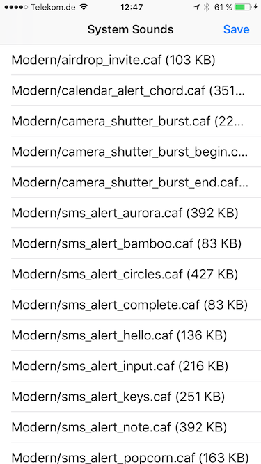

# SwiftySystemSounds
Lists, plays and extracts the system sounds on iOS.

Based on `AudioServicesCreateSystemSoundID` and `AudioServicesPlaySystemSound` of the `AudioToolbox.framework`

Thanks to [TUNER88/iOSSystemSoundsLibrary](https://github.com/TUNER88/iOSSystemSoundsLibrary) for providing the idea and the Objective-C version.

# Functionality:
* List all available system sounds on the device
* Does not work on the Simulator
* Can save the sound files to the Documents folder of the app
* Then use Xcode to transfer the sound files to your computer

# Screenshot

# Available system sounds on iOS 10.3.2 (14F89)

| Name | Size |
| --- | --- |
| Modern/airdrop_invite.caf | 103 KB |
| Modern/calendar_alert_chord.caf | 351 KB |
| Modern/camera_shutter_burst.caf | 22 KB |
| Modern/camera_shutter_burst_begin.caf | 22 KB |
| Modern/camera_shutter_burst_end.caf | 31 KB |
| Modern/sms_alert_aurora.caf | 392 KB |
| Modern/sms_alert_bamboo.caf | 83 KB |
| Modern/sms_alert_circles.caf | 427 KB |
| Modern/sms_alert_complete.caf | 83 KB |
| Modern/sms_alert_hello.caf | 136 KB |
| Modern/sms_alert_input.caf | 216 KB |
| Modern/sms_alert_keys.caf | 251 KB |
| Modern/sms_alert_note.caf | 392 KB |
| Modern/sms_alert_popcorn.caf | 163 KB |
| Modern/sms_alert_synth.caf | 110 KB |
| New/Anticipate.caf | 402 KB |
| New/Bloom.caf | 286 KB |
| New/Calypso.caf | 163 KB |
| New/Choo_Choo.caf | 392 KB |
| New/Descent.caf | 169 KB |
| New/Fanfare.caf | 269 KB |
| New/Ladder.caf | 233 KB |
| New/Minuet.caf | 621 KB |
| New/News_Flash.caf | 523 KB |
| New/Noir.caf | 338 KB |
| New/Sherwood_Forest.caf | 420 KB |
| New/Spell.caf | 508 KB |
| New/Suspense.caf | 373 KB |
| New/Telegraph.caf | 216 KB |
| New/Tiptoes.caf | 276 KB |
| New/Typewriters.caf | 233 KB |
| New/Update.caf | 401 KB |
| ReceivedMessage.caf | 95 KB |
| RingerChanged.caf | 15 KB |
| SIMToolkitCallDropped.caf | 15 KB |
| SIMToolkitGeneralBeep.caf | 34 KB |
| SIMToolkitNegativeACK.caf | 15 KB |
| SIMToolkitPositiveACK.caf | 111 KB |
| SIMToolkitSMS.caf | 43 KB |
| SentMessage.caf | 91 KB |
| Swish.caf | 128 KB |
| Tink.caf | 8 KB |
| Tock.caf | 8 KB |
| acknowledgment_received.caf | 83 KB |
| acknowledgment_sent.caf | 114 KB |
| alarm.caf | 361 KB |
| begin_record.caf | 44 KB |
| camera_timer_countdown.caf | 92 KB |
| camera_timer_final_second.caf | 92 KB |
| connect_power.caf | 163 KB |
| ct-busy.caf | 26 KB |
| ct-congestion.caf | 13 KB |
| ct-error.caf | 49 KB |
| ct-keytone2.caf | 9 KB |
| ct-path-ack.caf | 9 KB |
| end_record.caf | 42 KB |
| focus_change_app_icon.caf | 202 KB |
| focus_change_keyboard.caf | 19 KB |
| focus_change_large.caf | 255 KB |
| focus_change_small.caf | 195 KB |
| go_to_sleep_alert.caf | 292 KB |
| jbl_ambiguous.caf | 77 KB |
| jbl_begin.caf | 64 KB |
| jbl_cancel.caf | 81 KB |
| jbl_confirm.caf | 59 KB |
| jbl_no_match.caf | 80 KB |
| key_press_click.caf | 4 KB |
| key_press_delete.caf | 5 KB |
| key_press_modifier.caf | 6 KB |
| keyboard_press_clear.caf | 59 KB |
| keyboard_press_delete.caf | 42 KB |
| keyboard_press_normal.caf | 29 KB |
| lock.caf | 86 KB |
| long_low_short_high.caf | 46 KB |
| low_power.caf | 123 KB |
| mail-sent.caf | 265 KB |
| middle_9_short_double_low.caf | 91 KB |
| nano/3rdParty_DirectionDown_Haptic.caf | 53 KB |
| nano/3rdParty_DirectionUp_Haptic.caf | 57 KB |
| nano/3rdParty_Failure_Haptic.caf | 77 KB |
| nano/3rdParty_Retry_Haptic.caf | 65 KB |
| nano/3rdParty_Start_Haptic.caf | 63 KB |
| nano/3rdParty_Stop_Haptic.caf | 88 KB |
| nano/3rdParty_Success_Haptic.caf | 84 KB |
| nano/Alarm_Haptic.caf | 275 KB |
| nano/Alarm_Nightstand_Haptic.caf | 398 KB |
| nano/Alert_3rdParty_Haptic.caf | 216 KB |
| nano/Alert_3rdParty_Salient_Haptic.caf | 303 KB |
| nano/Alert_ActivityGoalAttained_Haptic.caf | 160 KB |
| nano/Alert_ActivityGoalAttained_Salient_Haptic.caf | 248 KB |
| nano/Alert_ActivityGoalBehind_Haptic.caf | 21 KB |
| nano/Alert_ActivityGoalBehind_Salient_Haptic.caf | 109 KB |
| nano/Alert_ActivityGoalClose_Haptic.caf | 21 KB |
| nano/Alert_BatteryLow_10p_Haptic.caf | 173 KB |
| nano/Alert_BatteryLow_5p_Haptic.caf | 173 KB |
| nano/Alert_BatteryLow_5p_Salient_Haptic.caf | 261 KB |
| nano/Alert_Calendar_Haptic.caf | 187 KB |
| nano/Alert_Calendar_Salient_Haptic.caf | 320 KB |
| nano/Alert_Mail_Haptic.caf | 363 KB |
| nano/Alert_Mail_Salient_Haptic.caf | 451 KB |
| nano/Alert_MapsDirectionsInApp_Haptic.caf | 179 KB |
| nano/Alert_Messages_1_Haptic.caf | 363 KB |
| nano/Alert_Messages_1_Salient_Haptic.caf | 451 KB |
| nano/Alert_Messages_2_Haptic.caf | 363 KB |
| nano/Alert_Messages_3_Haptic.caf | 363 KB |
| nano/Alert_PassbookBalance_Haptic.caf | 271 KB |
| nano/Alert_PassbookGeofence_Haptic.caf | 271 KB |
| nano/Alert_PassbookGeofence_Salient_Haptic.caf | 359 KB |
| nano/Alert_PhotostreamActivity_Haptic.caf | 363 KB |
| nano/Alert_ReminderDue_Haptic.caf | 187 KB |
| nano/Alert_ReminderDue_Salient_Haptic.caf | 320 KB |
| nano/Alert_Voicemail_Haptic.caf | 363 KB |
| nano/Alert_Voicemail_Salient_Haptic.caf | 451 KB |
| nano/Alert_WalkieTalkie_Haptic.caf | 26 KB |
| nano/AutoUnlock_Haptic.caf | 28 KB |
| nano/BatteryMagsafe_Haptic.caf | 213 KB |
| nano/Beat_Haptic.caf | 6 KB |
| nano/BuddyPairingFailure_Haptic.caf | 93 KB |
| nano/BuddyPairingRemoteConnection_Haptic.caf | 271 KB |
| nano/BuddyPairingRemoteTap_Haptic.caf | 7 KB |
| nano/BuddyPairingSuccess_Haptic.caf | 271 KB |
| nano/CameraCountdownImminent_Haptic.caf | 100 KB |
| nano/CameraCountdownTick_Haptic.caf | 15 KB |
| nano/CameraShutter_Haptic.caf | 41 KB |
| nano/Detent_Haptic.caf | 6 KB |
| nano/DoNotDisturb_Haptic.caf | 113 KB |
| nano/ET_BeginNotification_Haptic.caf | 200 KB |
| nano/ET_BeginNotification_Salient_Haptic.caf | 289 KB |
| nano/ET_RemoteTap_Receive_Haptic.caf | 10 KB |
| nano/ET_RemoteTap_Send_Haptic.caf | 8 KB |
| nano/Experimental_Orb1_Haptic.caf | 17 KB |
| nano/Experimental_Orb2_Haptic.caf | 17 KB |
| nano/Experimental_Orb3_Haptic.caf | 17 KB |
| nano/Experimental_Orb4_Haptic.caf | 17 KB |
| nano/Experimental_Orb5_Haptic.caf | 17 KB |
| nano/GoToSleep_Haptic.caf | 269 KB |
| nano/HourlyChime_Haptic.caf | 378 KB |
| nano/HummingbirdCompletion_Haptic.caf | 363 KB |
| nano/HummingbirdNotification_Haptic.caf | 357 KB |
| nano/MessagesIncoming_Haptic.caf | 101 KB |
| nano/MessagesOutgoing_Haptic.caf | 88 KB |
| nano/NavigationGenericManeuver_Haptic.caf | 179 KB |
| nano/NavigationGenericManeuver_Salient_Haptic.caf | 267 KB |
| nano/NavigationLeftTurn_Haptic.caf | 170 KB |
| nano/NavigationLeftTurn_Salient_Haptic.caf | 258 KB |
| nano/NavigationRightTurn_Haptic.caf | 203 KB |
| nano/NavigationRightTurn_Salient_Haptic.caf | 291 KB |
| nano/Notification_Haptic.caf | 363 KB |
| nano/Notification_Salient_Haptic.caf | 451 KB |
| nano/OnOffPasscodeFailure_Haptic.caf | 93 KB |
| nano/OnOffPasscodeUnlockCampanion_Haptic.caf | 153 KB |
| nano/OnOffPasscodeUnlock_Haptic.caf | 152 KB |
| nano/OrbExit_Haptic.caf | 23 KB |
| nano/OrbLayers_Haptic.caf | 6 KB |
| nano/PhoneAnswer_Haptic.caf | 7 KB |
| nano/PhoneHangUp_Haptic.caf | 7 KB |
| nano/PhoneHold_Haptic.caf | 7 KB |
| nano/PhotosZoomDetent_Haptic.caf | 6 KB |
| nano/Preview_AudioAndHaptic.caf | 10 KB |
| nano/QB_Dictation_Haptic.caf | 27 KB |
| nano/QB_Dictation_Off_Haptic.caf | 28 KB |
| nano/RemoteCameraShutterBurstBegin_Haptic.caf | 13 KB |
| nano/RemoteCameraShutterBurstEnd_Haptic.caf | 17 KB |
| nano/RingtoneDucked_UK_Haptic.caf | 320 KB |
| nano/RingtoneDucked_US_Haptic.caf | 320 KB |
| nano/Ringtone_UK_Haptic.caf | 320 KB |
| nano/Ringtone_US_Haptic.caf | 320 KB |
| nano/SalientNotification_Haptic.caf | 286 KB |
| nano/SedentaryTimer_Haptic.caf | 21 KB |
| nano/SedentaryTimer_Salient_Haptic.caf | 110 KB |
| nano/SiriAutoSend_Haptic.caf | 88 KB |
| nano/SiriStart_Haptic.caf | 34 KB |
| nano/SiriStopFailure_Haptic.caf | 98 KB |
| nano/SiriStopSuccess_Haptic.caf | 49 KB |
| nano/StockholmActiveSingleCycle_Haptic.caf | 6 KB |
| nano/StockholmActive_Haptic.caf | 6 KB |
| nano/StockholmFailure_Haptic.caf | 93 KB |
| nano/Stockholm_Haptic.caf | 116 KB |
| nano/StopwatchLap_Haptic.caf | 7 KB |
| nano/StopwatchReset_Haptic.caf | 7 KB |
| nano/StopwatchStart_Haptic.caf | 7 KB |
| nano/StopwatchStop_Haptic.caf | 7 KB |
| nano/SwTest1_Haptic.caf | 165 KB |
| nano/SystemStartup_Haptic.caf | 359 KB |
| nano/TimerCancel_Haptic.caf | 7 KB |
| nano/TimerPause_Haptic.caf | 7 KB |
| nano/TimerStart_Haptic.caf | 7 KB |
| nano/TimerWheelHoursDetent_Haptic.caf | 7 KB |
| nano/TimerWheelMinutesDetent_Haptic.caf | 7 KB |
| nano/Timer_Haptic.caf | 275 KB |
| nano/UISwipe_Haptic.caf | 28 KB |
| nano/UISwitch_Off_Haptic.caf | 9 KB |
| nano/UISwitch_On_Haptic.caf | 9 KB |
| nano/VoiceOver_Click_Haptic.caf | 13 KB |
| nano/WalkieTalkieActiveEnd_Haptic.caf | 33 KB |
| nano/WalkieTalkieActiveStart_Haptic.caf | 16 KB |
| nano/Warsaw_Haptic.caf | 86 KB |
| nano/WorkoutComplete_Haptic.caf | 160 KB |
| nano/WorkoutCountdown_Haptic.caf | 357 KB |
| nano/WorkoutPaused_Haptic.caf | 17 KB |
| nano/WorkoutPressStart_Haptic.caf | 7 KB |
| nano/WorkoutResumed_Haptic.caf | 23 KB |
| nano/WorkoutSaved_Haptic.caf | 150 KB |
| nano/WorkoutSelect_Haptic.caf | 7 KB |
| nano/busy_tone_ansi.caf | 92 KB |
| nano/busy_tone_cept.caf | 92 KB |
| nano/call_waiting_tone_ansi.caf | 886 KB |
| nano/call_waiting_tone_cept.caf | 710 KB |
| nano/ct-call-waiting.caf | 92 KB |
| nano/dtmf-0.caf | 9 KB |
| nano/dtmf-1.caf | 8 KB |
| nano/dtmf-2.caf | 8 KB |
| nano/dtmf-3.caf | 11 KB |
| nano/dtmf-4.caf | 11 KB |
| nano/dtmf-5.caf | 9 KB |
| nano/dtmf-6.caf | 11 KB |
| nano/dtmf-7.caf | 10 KB |
| nano/dtmf-8.caf | 10 KB |
| nano/dtmf-9.caf | 9 KB |
| nano/dtmf-pound.caf | 9 KB |
| nano/dtmf-star.caf | 12 KB |
| nano/end_call_tone_cept.caf | 110 KB |
| nano/ringback_tone_ansi.caf | 533 KB |
| nano/ringback_tone_aus.caf | 269 KB |
| nano/ringback_tone_cept.caf | 445 KB |
| nano/ringback_tone_hk.caf | 357 KB |
| nano/ringback_tone_uk.caf | 196 KB |
| nano/sms-received1.caf | 163 KB |
| nano/vc~ended.caf | 26 KB |
| nano/vc~invitation-accepted.caf | 253 KB |
| nano/vc~ringing.caf | 235 KB |
| navigation_pop.caf | 1.024 KB |
| navigation_push.caf | 941 KB |
| new-mail.caf | 269 KB |
| payment_failure.caf | 776 KB |
| payment_success.caf | 128 KB |
| photoShutter.caf | 95 KB |
| shake.caf | 110 KB |
| short_double_high.caf | 21 KB |
| short_double_low.caf | 21 KB |
| short_low_high.caf | 22 KB |
| sms-received1.caf | 163 KB |
| sms-received2.caf | 803 KB |
| sms-received3.caf | 304 KB |
| sms-received4.caf | 271 KB |
| sms-received5.caf | 258 KB |
| sms-received6.caf | 264 KB |
| tweet_sent.caf | 123 KB |
| ussd.caf | 234 KB |
| warsaw.caf | 139 KB |
| wheels_of_time.caf | 6 KB |

Furthermore, a list of system sound IDs can be found [here](http://iphonedevwiki.net/index.php/AudioServices).

# Diff to iOS 11.0 beta (15A5318g)

### Added:

| Name | Size |
| --- | --- |
| engage_power.caf | 940 KB |
| nano/Alert_ActivityFriendsGoalAttained_Haptic.caf | 160 KB |
| nano/Alert_SpartanConnected_LowLatency_Haptic.caf | 32 KB |
| nano/Alert_SpartanConnecting_Haptic.caf | 32 KB |
| nano/Alert_SpartanConnecting_LowLatency_Haptic.caf | 32 KB |
| nano/Alert_SpartanDisconnected_LowLatency_Haptic.caf | 32 KB |
| nano/jbl_begin.caf | 64 KB |
| nano/jbl_cancel.caf | 81 KB |
| nano/jbl_confirm.caf | 59 KB |

### Removed:

| Name | Size |
| --- | --- |
| Modern/airdrop_invite.caf | 103 KB |
| Modern/calendar_alert_chord.caf | 351 KB |
| Modern/sms_alert_aurora.caf | 392 KB |
| Modern/sms_alert_bamboo.caf | 83 KB |
| Modern/sms_alert_circles.caf | 427 KB |
| Modern/sms_alert_complete.caf | 83 KB |
| Modern/sms_alert_hello.caf | 136 KB |
| Modern/sms_alert_input.caf | 216 KB |
| Modern/sms_alert_keys.caf | 251 KB |
| Modern/sms_alert_note.caf | 392 KB |
| Modern/sms_alert_popcorn.caf | 163 KB |
| Modern/sms_alert_synth.caf | 110 KB |
